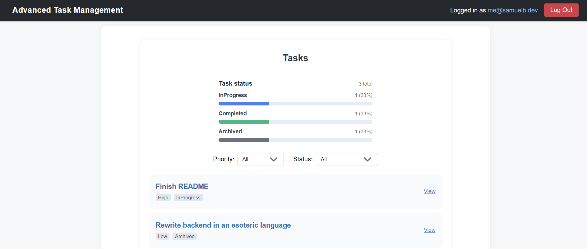

# Advanced Task Management System



## Overview

The app is a simple task manager with create/read/update/delete operations and a small set of "advanced" requirements to demonstrate middleware, event handling for critical updates, lazy-loading on the frontend, and JWT-based protection of the API.

## Getting started — prerequisites

Install required tools:
- Docker & Docker Compose (for full stack) — https://www.docker.com/
- .NET 8 SDK (if you want to run the API locally outside Docker) — https://dotnet.microsoft.com/
- Node.js (v20+) and pnpm (for frontend local dev) — https://pnpm.io/

You will also need Auth0 credentials (Domain, Client ID, Audience) for the frontend and API authentication to work.

## Environment variables

Create a `.env` file at the repository root (or set environment variables in your shell). See `.env.example`

## Run with Docker Compose (recommended)

This will build the frontend and API images and bring up Postgres.

From the repository root:

```powershell
docker-compose up --build
```

Open the frontend at http://localhost:5173 (or the value of FRONTEND_PORT). The API will be reachable at http://localhost:5274 by default and the docker-compose wiring will be used.

The API automatically applies EF Core migrations on startup (see `Program.cs`). If you need to rebuild migrations or run them manually you can use `dotnet ef` tooling inside the `api/TaskManagement.Api` project.

## Run locally without Docker

Backend (requires .NET 8 and a running Postgres instance):

1. Ensure you have a PostgreSQL server running and update `ConnectionStrings__TasksDb` accordingly in environment or `appsettings.json`.
2. From `api/TaskManagement.Api` run:

```powershell
dotnet run
```

Frontend (requires Node.js and pnpm):

1. Install dependencies:

```powershell
cd frontend
pnpm install
pnpm dev
```

Note: The frontend `dev` script copies the root `.env` into the frontend folder before starting Vite; ensure your `.env` is present.

## Logs

- API request log: `logs/api-requests.log` — created by `ApiRequestLoggingMiddleware` (method, endpoint, IP, user agent, timestamp)
- Critical high-priority events: `logs/critical-high-priority-tasks.log` — created by `HighPriorityTaskEventService`

These files are created under the working directory of the API container or local running process. When running in Docker the files will be inside the container filesystem unless you add a bind mount.

## Tests

Backend unit tests are present under `api/TaskManagement.Tests` and can be run with:

```powershell
cd api
dotnet test
```

## Possible future improvements
- Add SignalR/custom Websocket implementation for real-time updates across browser tabs
- Allow for configurable page size on the frontend
- Allow tasks to be selected using chekboxes to support batch deletion
- Add calendar selection UI for task due date with time selection
- Harden validation around due dates and business rules
- Add integration tests, frontend unit tests, and end-to-end UI Tests
- Add a reverse proxy (like Nginx) and TLS
- Add docker volume mapping for logs so they persist on host for debugging
- Strikethrough completed tasks on the task list UI
- Optimise Docker images
